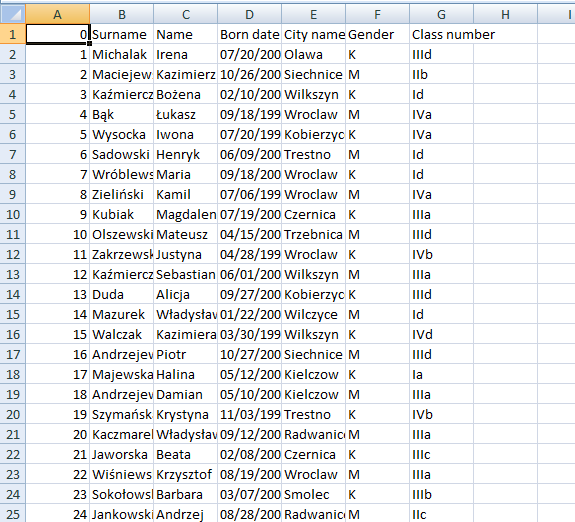

# Data Generator

This repo alows You to create data necessary for DB course at Wroclaw University of Technology, the result of running a script is a excel file which U can Use as source for Your DB. 

### Using Script U can generate:
```
-Student data 
-Students marks
-Teacher data
```




## Getting Started
To create Your own data just, run __init__.py file. By default it creates student data, to create note or teacher data, just uncomment it in __innit__.py file

### Prerequisites
```
-xlsxwriter
-radar
-roman
```


## Authors

* [tugot17](https://github.com/tugot17)


## License

This project is licensed under the MIT License - see the [LICENSE.md](LICENSE.md) file for details


